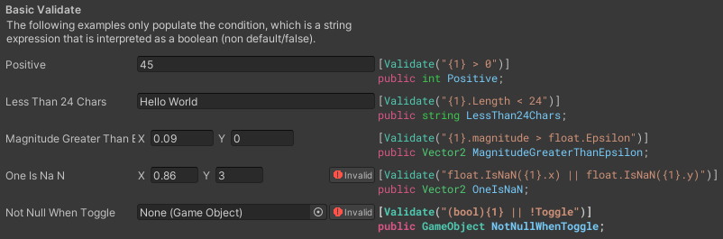
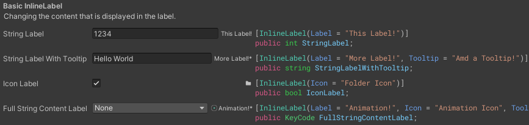

NAF Unity Tools
===============

Inspired by Odin Inspector, NAF Unity Tools is a collection of Editor tools and utilities to improve your Unity development experience. Most notably, this includes an extremely powerful and flexible property drawer system which allows for creating super detailed inspectors without needing to write a single line of custom editor code.

This project is extremely optimized for performance and flexibility, improving base Unity Editor functionality without sacrificing performance (more than normal custom editors).

**This specific project is a sandbox using an actual Unity project. All shipped code will be a DLL plugin that can be imported as a single file**. This has been tested and run in other projects.

*This documentation is a work in progress as this project is still in development.*